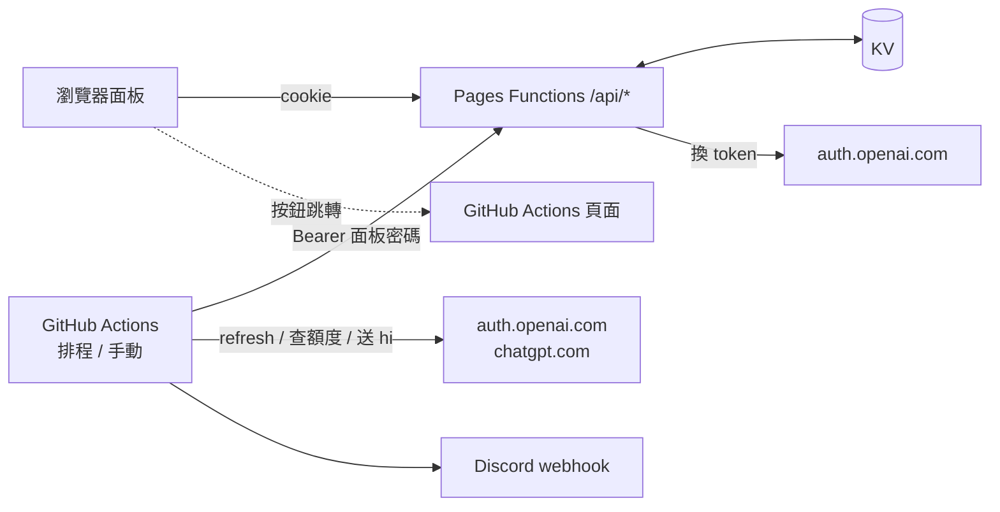

# GPT Checker

管理多個 ChatGPT / Codex 帳號的額度面板：用 OAuth 或匯入 JSON 新增帳號，由 GitHub Actions 定期查額度，並在額度窗口還沒開始倒數時送一句 `hi` 啟動窗口，結果通知到 Discord。

> 非官方工具，與 OpenAI 無關。使用的是 Codex CLI 相同的非公開端點，行為可能隨時改變；請自行確認符合 OpenAI 的使用條款。

## 功能

- 密碼保護的面板（Cloudflare Pages + Pages Functions + KV），前端為純 HTML / JS。
- 新增帳號：OAuth 登入（貼 callback 網址）或匯入 JSON（CLIProxyAPI 憑證、`~/.codex/auth.json`、codex-tools `accounts.json`）。
- 匯出選取的帳號為 CLIProxyAPI 格式（可直接匯回）。
- GitHub Actions 每 2 天查額度＋送 hi；也可手動執行（只查額度，或查額度＋送 hi）。
- Discord 通知每個帳號的結果、剩餘額度與重置時間，異常排在最前面。

## 架構



- **面板（Cloudflare Pages）**：帳號管理、設定、顯示結果。只有 OAuth 換 token 會連到 OpenAI（`auth.openai.com`）。
- **GitHub Actions**：refresh token、查額度、送 hi 全部在 runner 上執行，透過面板的 Bearer 專用端點讀寫 KV。
  Cloudflare 的 Workers / Pages 連不到 `chatgpt.com`（會被擋），所以查額度只能走 GHA，詳見 [docs/pitfalls.md](docs/pitfalls.md)。
- 面板不會自己觸發 GHA，也不保存 GitHub token；右上角按鈕只是開啟 workflow 頁面，到 GitHub 按 Run workflow。

### 一次 GHA 執行的流程

每個啟用的帳號依序處理，單一帳號失敗不影響其他帳號：

1. access token 5 分鐘內到期就先 refresh，新 token 立刻寫回面板。
2. 查額度（401 時強制 refresh 後重試一次）。
3. 送 hi 模式下，符合條件才送 hi；送完等 3 秒再查一次額度。
4. 全部帳號跑完後，額度結果整批寫回面板一次。
5. 送 hi 模式才通知 Discord。

**送 hi 條件**：任一額度窗口還沒開始倒數，也就是「距離重置 ≥ 窗口長度 − 10 秒」。不看剩餘 %（用過就會開始倒數，沒倒數就一定是 100%）。已開始倒數的窗口不會重送。

**結果判定**

| 情況                                                              | 結果                                        |
| ----------------------------------------------------------------- | ------------------------------------------- |
| 送 hi 時對方回報錯誤（非 2xx、`failed` / `error` 事件、串流中斷） | 算已送出，錯誤記在「最近送 hi」，不列為異常 |
| 送 hi 回 401                                                      | refresh 後重送一次                          |
| GHA 連不上對方、被 Cloudflare 擋下                                | 失敗，列為異常                              |
| refresh token 失效                                                | 帳號標成「需重新登入」，列為異常            |
| 有任何異常、Discord 通知失敗、讀不到面板                          | GHA run 顯示失敗                            |

### 執行模式

| 觸發                             | 模式          | Discord | 更新「最近送 hi」 |
| -------------------------------- | ------------- | ------- | ----------------- |
| 排程（`0 0 */2 * *` UTC）        | 查額度＋送 hi | 通知    | 是                |
| 手動，開關為「只查額度」（預設） | 只查額度      | 不通知  | 否                |
| 手動，開關為「查額度＋送 hi」    | 查額度＋送 hi | 通知    | 是                |

手動模式存在面板上，GHA 執行時向面板讀取。workflow 設定 `concurrency`（`queue: max`），同時間只跑一個 run，多次手動執行會排隊。

## 部署

### 1. Cloudflare Pages

1. 建立 KV namespace（例如 `gpt-checker-accounts`）。
2. 建立 Pages 專案並連到這個 repo：組建命令留空、輸出目錄 `public`、根目錄留空。`functions/` 會自動部署成 Pages Functions。
3. 在 Pages 設定頁：
   - KV 綁定：變數名稱 `ACCOUNTS` → 剛建立的 namespace（repo 沒有 `wrangler.toml`，要在設定頁手動綁定）。
   - 環境變數：`PANEL_PASSWORD`（面板密碼，也是 GHA 的驗證憑證，請用夠長的隨機字串）。沒設定時所有 API 一律回 500。

### 2. GitHub Actions

在 repo 的 Settings → Secrets and variables → Actions 設定：

| 類型             | 名稱             | 說明                                                     |
| ---------------- | ---------------- | -------------------------------------------------------- |
| Secret           | `PANEL_URL`      | 面板網址，例如 `https://<project>.pages.dev`             |
| Secret           | `PANEL_PASSWORD` | 與 Pages 的 `PANEL_PASSWORD` 相同                        |
| Variable（選填） | `HI_MODEL`       | 送 hi 用的模型，預設 `gpt-6-luna`（`src/lib/openai.ts`） |

`hi.yml` 要在**預設分支**上，GitHub 才會顯示 Run workflow 按鈕並執行排程。

workflow 不跑 `npm ci`（腳本沒有執行期依賴），直接用 `npx --yes tsx@<版本>` 執行；升級 `package.json` 的 tsx 時要一起改 `hi.yml`，`test/workflow.test.ts` 會檢查兩邊一致。

### 3. 面板設定

登入面板後在「設定」卡片填：

- **GitHub repo**：`https://github.com/<owner>/<repo>`（貼 actions 或 workflow 頁面網址也會自動正規化）。
- **Discord webhook**（選填）：Discord 頻道 → 編輯頻道 → 整合 → Webhook → 新 Webhook → 複製網址。只接受 `https://discord.com/api/webhooks/<id>/<token>`（含 ptb / canary / discordapp.com）。

## 使用

1. **新增帳號**
   - OAuth 登入：按「開啟登入頁」→ 登入 OpenAI → 會跳到 `http://localhost:1455/auth/callback?code=…`（打不開是正常的）→ 把整串網址貼回面板送出，15 分鐘內有效。
   - 匯入 JSON：可多選檔案或直接貼上。沒有 `refresh_token` 的項目會被拒絕；缺 `account_id` 時從 id_token 補上。同一帳號（account id + email）重複匯入會覆蓋。
2. **勾選帳號後按「啟用」**：只有啟用的帳號會交給 GHA。勾選本身只是選取，不會儲存。
3. **選手動模式**：右上角開關，決定手動執行時要不要送 hi。
4. **執行**：按「前往 GHA 執行」，到 GitHub 按 Run workflow；或等排程。
5. **看結果**：執行完回面板按「重新載入」。

## 本機開發

需要 Node.js 22。

```bash
npm ci
cp .dev.vars.example .dev.vars        # 填 PANEL_PASSWORD
npx wrangler pages dev public --kv ACCOUNTS
```

- `npm run typecheck`：TypeScript 型別檢查。
- `npm test`：Vitest（mock fetch 與 in-memory KV，不會連到 OpenAI）。
- `npm run build`：型別檢查＋測試。
- 本機跑 GHA 腳本：設定 `PANEL_URL`、`PANEL_PASSWORD`、`TRIGGER`（`schedule` 或 `manual`）後執行 `npx tsx scripts/gha-run.ts`。本機的 Cloudflare workerd 同樣連不到 `chatgpt.com`，但 Node 直接執行的腳本可以。

## API

所有 `/api/*` 都要驗證：瀏覽器用登入後的 session cookie，GHA 用 `Authorization: Bearer <PANEL_PASSWORD>`（constant-time 比對）。帶 cookie 的寫入請求另外檢查 `Origin` 必須同源。

| 方法      | 路徑                                      | 說明                                                                                   |
| --------- | ----------------------------------------- | -------------------------------------------------------------------------------------- |
| POST      | `/api/login`、`/api/logout`               | 登入 / 登出（不需驗證）                                                                |
| GET       | `/api/me`                                 | 檢查是否已登入                                                                         |
| GET       | `/api/accounts`                           | 帳號列表（不含 token）                                                                 |
| POST      | `/api/accounts/enabled`                   | `{ids, enabled}` 啟用 / 停用                                                           |
| POST      | `/api/accounts/delete`                    | `{ids}` 刪除                                                                           |
| POST      | `/api/import`                             | 匯入任意支援格式的 JSON                                                                |
| GET       | `/api/export?ids=a,b`                     | 匯出 CPA 格式（一個是物件，多個是陣列）                                                |
| POST      | `/api/oauth/start`、`/api/oauth/callback` | OAuth（PKCE）開始 / 貼 callback 網址                                                   |
| GET / PUT | `/api/config`                             | repo 網址、手動模式、Discord webhook（部分更新）                                       |
| GET       | `/api/gha/accounts`                       | **只接受 Bearer**：啟用的帳號（含 token）、手動模式、webhook                           |
| PATCH     | `/api/gha/accounts/:id/tokens`            | **只接受 Bearer**：refresh 後寫回 token（帶 `expectRefreshToken`，與 KV 不同就不覆寫） |
| POST      | `/api/gha/status`                         | **只接受 Bearer**：整批寫回額度結果                                                    |

## KV 結構

| key                       | 內容                                       | 何時寫入                  |
| ------------------------- | ------------------------------------------ | ------------------------- |
| `account:<id>`            | 身分與 token                               | 匯入、登入、refresh、失效 |
| `index:accounts`          | 帳號 id 陣列                               | 新增 / 刪除帳號           |
| `enabled`                 | 啟用的帳號 id 陣列                         | 按「啟用 / 停用」         |
| `status`                  | `{ [id]: { usage, usageError, lastRun } }` | GHA 每次執行整批一次      |
| `config`                  | repo 網址、手動模式、Discord webhook       | 設定有變動時              |
| `oauth:<state>`           | PKCE session，TTL 15 分鐘                  | 開始 OAuth                |
| `session:<sha256(token)>` | 登入 session，TTL 7 天                     | 登入                      |

KV 免費方案每天只能寫 1,000 次，所以常變動的資料集中在少數 key、整批寫入，內容沒變就不寫，一般路徑也不呼叫 `list()`。舊版資料格式讀取時自動相容。

## 安全性

- 面板密碼同時是 GHA 的憑證，`/api/gha/*` 會回傳 token；密碼外洩等於所有帳號外洩。
- 匯出的 JSON 含 token，請妥善保管。
- session cookie：`HttpOnly`、`Secure`、`SameSite=Strict`，KV 只存 token 的雜湊；登出會讓 session 失效。
- CSP 只允許同源資源（`public/_headers`），前端動態內容一律用 `textContent` 寫入。
- GHA log 只印狀態，不印 token。

## 專案結構

```
functions/api/[[path]].ts   Pages Functions 入口，交給 src/app.ts
src/app.ts                  路由表、驗證、同源檢查
src/routes/                 API handler
src/lib/                    OAuth、token、額度、送 hi、匯入 / 匯出、KV、session
scripts/gha-run.ts          GHA 入口
scripts/runner.ts           GHA 流程與 Discord 通知（可測試的純邏輯）
public/                     前端（index.html、app.js、style.css、favicon.svg、_headers）
test/                       Vitest
.github/workflows/hi.yml    排程＋手動執行
docs/plan.md                原始實作計畫
docs/pitfalls.md            踩坑紀錄與設計判斷
```

## 已知限制

- 排程 `*/2` 在月底可能連續兩天執行。
- public repo 60 天沒有活動，GitHub 會停用排程 workflow。
- 付費方案（5 小時 / 每週窗口）的送 hi 邏輯沒有用真實帳號驗證過。
- 一次匯入超過約 990 個帳號會碰到 KV 每天 1,000 次寫入上限。

## License

[MIT](LICENSE)
