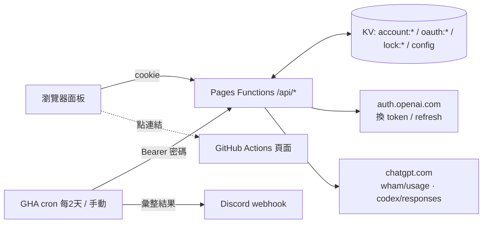

最後更新: 2026/10/1
狀態: 原始計畫，僅供紀錄；現況見 [README](../README.md)，設計變更見 [pitfalls.md](pitfalls.md)

**Implementation Plan：GPT Checker（Cloudflare Pages）**

**Problem Statement**
在 Cloudflare Pages 上做一個有密碼保護的面板，用來管理 ChatGPT/Codex 帳號，功能包括 OAuth 登入、匯入匯出、查額度。GHA 每 2 天執行一次，也可以手動執行：對勾選的帳號檢查條件，符合的就送一句 "hi" 啟動額度窗口，結果通知到 Discord。

**Requirements**
- 登入：照 CPA 的做法。
  1. 用 PKCE 產生授權網址，`redirect_uri` 固定是 `http://localhost:1455/auth/callback`。
  2. 使用者把跳轉後的完整網址貼回面板。
  3. 後端解析網址並驗證 state，確認 session 存在且還沒完成，再換 token。
  - PKCE session 存 KV，TTL 15 分鐘。
- 匯入格式：CPA 扁平 JSON、`~/.codex/auth.json`、codex-tools 的 `accounts.json`（整個 store、單一 account、或陣列）。沒有 `refresh_token` 就拒絕。缺少 `account_id` 時，從 id_token 的 `https://api.openai.com/auth.chatgpt_account_id` 補上。
- 匯出：單一帳號可匯出 CPA 格式，全部帳號可匯出 codex-tools 的 `accounts.json`（`{version:2, accounts:[...]}`）。
- 驗證：面板用密碼加 HMAC 簽章 cookie。`/api/*` 全部要驗證：瀏覽器帶 cookie，GHA 帶 `Authorization: Bearer <PANEL_PASSWORD>`，一律用 constant-time 比對。
- 查額度：面板上手動刷新，只顯示結果，不發通知。
- 送 hi 的條件：任一額度窗口 `used_percent == 0`（剩 100%），而且距離重置 ≥ 29 天。重置時間優先用 `reset_after_seconds`，沒有的話用 `reset_at - now`。
- GHA：cron `0 0 */2 * *`（UTC），加上 `workflow_dispatch`。面板上存 GHA workflow 的網址，按鈕點了直接跳過去。
- 通知：只有 GHA 會發。內容包括每個帳號的結果（已送、略過、失敗）、剩餘額度、重置時間。異常（token 刷新失敗、refresh token 失效、查額度失敗、送 hi 失敗）會醒目標示。
- 技術選型：Pages Functions 加 TypeScript，前端純 HTML/JS，測試用 Vitest。依賴一律鎖定精確版本。

**Background（已查證）**
- OAuth 的常數和參數出自 CPA 的 `internal/auth/codex/openai_auth.go`：
  - `ClientID=app_EMoamEEZ73f0CkXaXp7hrann`
  - scope 是 `openid email profile offline_access`
  - 參數有 `prompt=login`、`id_token_add_organizations=true`、`codex_cli_simplified_flow=true`
  - token endpoint 是 `https://auth.openai.com/oauth/token`，換 code 和 refresh 都用 form 編碼。refresh 時帶 `scope=openid profile email`。
- Callback 驗證邏輯出自 CPA 的 `oauth_callback.go`。
- 每次 refresh 都會換一組新的 refresh token，舊的就失效（CPA 會處理 `refresh_token_reused` 錯誤），所以新 token 要立刻寫回 KV，並加一把 KV 鎖（TTL 60 秒）。KV 是最終一致性，這把鎖只能降低 GHA 和手動刷新同時執行時出事的機率，無法完全保證。
- 查額度參考 codex-tools 的 `usage.rs`：`GET https://chatgpt.com/backend-api/wham/usage`，header 帶 `Authorization: Bearer`、`ChatGPT-Account-Id`、`Accept: application/json`。
- 送 hi 參考 codex-tools 的 `warmup.rs`：
  - 請求：`POST https://chatgpt.com/backend-api/codex/responses`
  - header：`Accept: text/event-stream`、`User-Agent: codex_cli_rs/<ver>`、`Originator: codex_cli_rs`、`Version`、`session-id`
  - body：`stream:true`、`store:false`、`instructions:""`
  - 判斷：讀到 `response.completed` 或 `response.done` 就算成功，`response.failed` 或 `error` 算失敗。
  - 模型名稱做成 `HI_MODEL` 環境變數，預設值 `gpt-5.6-sol`（codex-tools 的預設）。
- 還沒驗證：從 Workers 打 `chatgpt.com` 和 `auth.openai.com` 會不會被 Cloudflare challenge 擋下，這會在 Task 3 部署後實測。另外，free 帳號是不是 30 天窗口，也要用真實回應確認。

**Proposed Solution**



**KV 結構**
- `account:<id>`：`{id, email, accountId, planType, tokens:{id_token, access_token, refresh_token}, expired, lastRefresh, selected, usage, usageError, updatedAt}`
- `oauth:<state>`：`{codeVerifier}`，TTL 900 秒
- `lock:<id>`：TTL 60 秒
- `config`：`{ghaUrl}`

**API**
- `login` / `logout`
- `GET /api/accounts`：只回傳摘要，不含 token
- `POST /api/oauth/start`、`POST /api/oauth/callback`
- `POST /api/import`、`GET /api/export`
- `PATCH` / `DELETE /api/accounts/:id`
- `POST /api/accounts/:id/usage`
- `POST /api/accounts/:id/hi`：依序執行刷新 token、查額度、判斷條件、送 hi、再查一次額度，最後回傳結果
- `GET` / `PUT /api/config`

**專案結構**
```
functions/_middleware.ts          # 驗證
functions/api/...                 # 路由
src/lib/                          # session, jwt, oauth, tokens, import, export, usage, hi, kv, lock
public/                           # index.html, app.js, style.css
scripts/gha-hi.ts                 # GHA 協調腳本
.github/workflows/hi.yml
wrangler.toml / vitest.config.ts / package.json
```

**秘密與設定**
- Pages：`PANEL_PASSWORD`、`SESSION_SECRET`、`HI_MODEL`（選填），KV binding 叫 `ACCOUNTS`。
- GitHub secrets：`PANEL_URL`、`PANEL_PASSWORD`、`DISCORD_WEBHOOK_URL`。

**Task Breakdown**

**Task 1：專案骨架和密碼驗證**
- 目標：專案可以在本機跑起來，面板和 API 都受密碼保護。
- 做法：
  - 用 `package.json` 鎖定 `wrangler`、`typescript`、`vitest`、`tsx` 的版本。
  - `wrangler.toml` 設定 `pages_build_output_dir="public"` 和 KV binding。
  - `src/lib/session.ts` 用 Web Crypto 做 HMAC-SHA256 簽章 cookie：HttpOnly、Secure、SameSite=Strict，7 天到期。
  - `_middleware.ts` 讓 `/api/login` 直接通過，其他路由接受 cookie 或 `Bearer PANEL_PASSWORD`，一律 constant-time 比對。
  - `public/` 放登入表單。
  - 測試環境用 in-memory 的 KV fake。
- 測試：簽章和驗章、竄改或過期的 cookie 會被拒絕、Bearer 驗證、沒登入時回 401。
- Demo：`wrangler pages dev` 開起來後，輸入錯的密碼被拒絕，輸入對的密碼可以進面板。

**Task 2：匯入帳號和帳號列表**
- 目標：可以貼上或上傳 JSON 匯入帳號，面板顯示帳號列表，也可以刪除帳號。
- 做法：
  - `src/lib/jwt.ts`：解碼 id_token 的 claims，只解碼、不驗簽，用來取 email、account_id、plan。
  - `src/lib/import.ts`：依序判斷格式：accounts store → stored account（`authJson`/`auth_json`）→ 陣列 → `tokens` 物件 → CPA 扁平格式。
  - 沒有 refresh_token 的帳號拒絕。用 `email + accountId` 產生 id，重複匯入時覆蓋。
  - 實作 `POST /api/import`、`GET /api/accounts`（不回傳 token）、`DELETE /api/accounts/:id`。
  - 前端：匯入區塊、帳號表格。
- 測試：每種格式各準備一份 fixture；缺 refresh_token、缺 account_id 從 claim 補上、重複匯入時覆蓋。
- Demo：匯入一份 CPA JSON 和一份 `auth.json`，列表上出現兩個帳號，刪掉其中一個。

**Task 3：刷新 token、查額度，以及 Workers 連線 spike**
- 目標：面板上按「刷新額度」可以看到每個窗口的剩餘 %、重置時間和方案類型。
- 做法：
  - `src/lib/tokens.ts`：access token 在 5 分鐘內到期（依 `expired` 或 JWT 的 exp 判斷）就先 refresh。refresh 前取得 `lock:<id>`，拿到新 token 立刻寫回 KV。
  - 遇到 `refresh_token_reused`，或 401/400 且錯誤是 invalid_grant，就把帳號標成失效。
  - `src/lib/usage.ts`：打 wham/usage，把 primary、secondary、additional 窗口整理成 `{usedPercent, windowSeconds, resetAt, resetAfterSeconds}`，存成 usage snapshot。
  - 實作 `POST /api/accounts/:id/usage`。前端每列加刷新按鈕，另有一顆「全部刷新」，會逐一呼叫每個帳號。
- 測試：mock fetch，涵蓋正常 refresh、reused 錯誤、窗口解析，以及只有單一窗口或缺欄位的情況。
- Demo 和 spike：部署到 Pages preview（部署前會先問你），用真實帳號按刷新。
  - 成功就保存一份去識別化的回應當 fixture，並確認 free 帳號的窗口長度。
  - 如果被 challenge 擋下，就停下來回報，討論要不要改成方案 b。

**Task 4：OAuth 登入（CPA 的貼網址流程）**
- 目標：在面板上完成 OAuth 登入並新增帳號。
- 做法：
  - `src/lib/oauth.ts`：產生 PKCE（S256）和 state，組出和 CPA 參數相同的授權網址。
  - `POST /api/oauth/start` 把 `oauth:<state>` 存進 KV（TTL 900）。
  - `POST /api/oauth/callback {redirect_url}` 依照 CPA 的順序處理：
    1. 解析 `code`、`state`、`error`。
    2. 驗證 state，確認 session 存在且還沒完成。
    3. 換 token，然後刪掉這筆 session。
    4. 沿用 Task 2 的流程寫入帳號。
  - 前端：「開啟登入頁」按鈕，加上貼網址的輸入框和提示文字。
- 測試：state 不符、session 過期、網址帶 error、缺 code、重複送出。
- Demo：開啟登入頁，登入後把 localhost 網址貼回面板，帳號出現在列表上，而且可以刷新額度。

**Task 5：匯出**
- 目標：匯出的 JSON 可以直接給 CPA 或 codex-tools 使用。
- 做法：
  - `src/lib/export.ts`：單一帳號轉成 CPA 扁平格式（`type:"codex"`，包含 `expired`、`last_refresh`、`plan_type`）。全部帳號轉成 codex-tools 的 `{version:2, accounts:[StoredAccount]}`。
  - 實作 `GET /api/export?format=cpa&id=` 和 `?format=codex-tools`，回應加上 `Content-Disposition`。
- 測試：匯出後再匯入（round-trip），內容要一致。
- Demo：下載兩種格式的檔案，再匯入回面板，資料不變。

**Task 6：勾選框和 GHA 連結**
- 目標：面板上可以勾選要讓 GHA 處理的帳號，也可以設定和開啟 GHA 連結。
- 做法：
  - `PATCH /api/accounts/:id {selected}`。
  - `GET /api/accounts?selected=1` 給 GHA 使用。
  - `GET` / `PUT /api/config {ghaUrl}`，只接受 `https://github.com/` 開頭的網址。
  - 前端：每列一個勾選框，另有「前往 GHA 執行」按鈕（新分頁開啟，加 `rel=noopener`）。
- 測試：勾選狀態會保存下來、過濾結果正確、不合法的網址被拒絕。
- Demo：勾選兩個帳號並設定連結，點按鈕會跳到 GitHub Actions 頁面。

**Task 7：送 hi 的 API**
- 目標：`POST /api/accounts/:id/hi` 完成整個流程並回傳結構化結果。
- 做法：
  - `src/lib/hi.ts`：
    - `shouldSendHi(usage, now)`：任一窗口用量為 0，而且距離重置 ≥ 29×86400 秒。
    - `sendHi()`：照 codex-tools 的 header 和 body，input 是 "hi"，逐塊讀 SSE，讀到終止事件就停，最多讀 1 MiB。
  - 路由流程：刷新 token → 查額度 → 判斷條件 → 符合才送 hi → 等 750ms → 再查一次額度。
  - 回傳 `{status: sent|skipped|failed, reason, remaining, resetAt, anomalies[]}`。
  - 這支 API 本身不發任何通知。
- 測試：條件的邊界值（剛好 29 天、99%、沒有窗口）；SSE 的 completed、failed、error 事件，以及事件被切在不同 chunk 的情況。
- Demo：用 curl 帶 Bearer 呼叫。不符合條件的帳號回 skipped，符合條件的帳號回 sent，而且額度窗口開始倒數。

**Task 8：GHA 腳本、workflow 和 Discord 通知（整合）**
- 目標：GHA 排程或手動執行時，處理勾選的帳號，並把結果送到 Discord。
- 做法：
  - `scripts/gha-hi.ts` 讀取環境變數 `PANEL_URL`、`PANEL_PASSWORD`、`DISCORD_WEBHOOK_URL`，依序：
    1. 取得勾選帳號。
    2. 逐一呼叫 hi API，單一帳號失敗不影響其他帳號。
    3. 組成 Discord embed。一則訊息最多 10 個 embed，超過就分批送。每個帳號顯示結果、剩餘 %、重置時間。有異常時用紅色 embed 放在最前面。
    4. 呼叫面板 API 失敗時，也要送一則異常通知。
  - `.github/workflows/hi.yml`：`schedule: cron '0 0 */2 * *'` 加上 `workflow_dispatch`，Node 22，`npm ci`，再執行 `npx tsx scripts/gha-hi.ts`。
- 測試：mock 面板 API 和 Discord，涵蓋 embed 內容、分批、異常置頂、API 整個掛掉的情況。
- Demo：在 GitHub 上按 Run workflow，Discord 收到每個帳號的結果。故意改錯密碼再跑一次，會收到異常通知。

**幾點注意**
- 部署、建立 KV namespace、設定 secrets 都會動到你的 Cloudflare 和 GitHub 帳號，執行時每一步都會先問你。
- 如果 repo 是 public，60 天沒有活動，GitHub 會停用排程 workflow。
- 面板密碼同時是 GHA 的驗證憑證，所以密碼要夠長。
- 我目前的理解是：排程和手動執行都只處理「面板上勾選的帳號」，而且都會檢查送 hi 的條件，沒有強制送的選項。